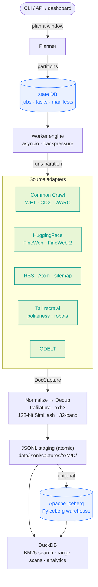

<div align="center">

# Awareness

**A private index of the public web — built on your laptop, queried like a table.**

Point it at a date range and it backfills historical public text. Leave it running and it tails
the web live. Everything lands in one local lake you can search from a dashboard, a terminal, or SQL.
One Python process. No Spark, no Kafka, no cloud account, nothing leaves the machine.

[](https://github.com/nazmiefearmutcu/awareness/releases)
[](LICENSE)
[](https://python.org)
[](https://iceberg.apache.org/)
[](https://duckdb.org/)

</div>

Awareness ingests **text and text-oriented metadata only**. No images, no binary media, no
login-gated content, no paywall circumvention. `robots.txt` is obeyed and per-domain politeness
is enforced on every live fetch. What you point it at is your responsibility; what it stores is
plain, auditable JSON on your disk.

---

## The two things it does

**BODY** — *backfill.* Ask for a historical window and Awareness plans it into partitions, pulls
the matching public text (Common Crawl, HuggingFace FineWeb, GDELT, seed feeds), de-duplicates it,
and writes it to the lake. Bounded, resumable, cancellable.

**TAIL** — *live capture.* Give it a list of RSS/Atom/sitemap seeds and it watches them, fetching
newly published articles as they appear until you stop it. Politeness and robots apply; crashes
resume where they left off.

Both feed the **same durable schema** (`DocCapture`) and the **same query surface**. A backfilled
2024 archive and a document captured thirty seconds ago sit in one table.

---

## Quickstart

```bash
git clone https://github.com/nazmiefearmutcu/awareness && cd awareness
uv venv --python 3.13 --seed
uv pip install -e '.[dev]'

awareness init                                   # create the local lake + state DB
awareness-api                                    # dashboard at http://127.0.0.1:8085
```

Open the dashboard, hit **Start** on the live tail, and watch real articles land. Or drive it
entirely from the shell:

```bash
awareness tail start                             # live capture from configs/tail_seeds.yaml
awareness search "central bank" --limit 20       # BM25 over everything captured
awareness browse                                 # read captured text in the terminal
```

---

## The workbench

A single-process FastAPI server ships a hand-written vanilla-JS SPA at `/` — no build step, no
runtime dependencies, no external requests (fonts are self-hosted; it renders fully offline). Ten
views, keyboard shortcuts `1`–`9` (and `0` for the tenth), a `⌘K` command palette,
and a light/dark theme that follows your system and remembers your choice.

**Dashboard** — the corpus at a glance, plus deep process telemetry: fetch latency percentiles,
robots-cache hit rate, dedup fold ratio, Iceberg row counts, staging lag, per-source health.


**Captures** — full-text search (BM25, prefix, or substring) with source / domain / language / date
filters, duplicate collapsing, and a reader for the stored text.


**Pipeline** — submit a backfill and watch every run: progress bars, task/doc/fold counters, and
status badges you can read by colour, not just by squinting at a label.


**Tail** — the live-capture console: queue depth, what's fetching now, what just landed, what's
backing off on retry, and recent storage commits.


**Settings** — every knob in one place, written straight to `awareness.yaml`: sources, politeness,
storage routing, search behaviour, the tail seed list, and a job-search profile — with live runtime
status underneath.


*(A **Work** section reuses the same engine to search public job boards against a saved profile.)*

---

## Feature surface

Beyond the ten workbench views, the API exposes the corpus through feature
subsystems — small, dependency-free modules under `src/awareness/`, all served
by the same single process:

**Analytics** (`/analytics/*`) — term frequency over time (day/week/month
buckets, zero-filled), rolling z-score spike detection, top terms
(stopword-filtered), domain and language breakdowns, and co-occurring term
counts: `/term-frequency`, `/top-terms`, `/spikes`, `/domains`, `/languages`,
`/co-occurring`.

**Alerts** (`/alerts/*`) — a SQLite rule store for keyword and term-spike
rules (threshold, window, cooldown), with CRUD at `/alerts/rules` (plus
`/alerts/rules/export` + `/alerts/rules/import` for moving rules between
instances), one-shot evaluation at `/alerts/check`, and `/alerts/status` +
`/alerts/firings` for the audit trail (the SPA Alerts view renders that
firing history — last-50 log and a 24 h count — with expandable firing
detail, and can test-run rules). Firings deliver to **all** configured
webhooks with retry; payloads are plain JSON or Slack-style
(`hooks.slack.com` auto-detected or forced per rule), and every webhook URL
is validated against the public-host gate before it is stored **or** called.
A periodic runner (`AW_ALERTS_AUTOSTART=1`) evaluates rules inside the API
process. The same engine is drivable from the terminal:

```bash
awareness alerts list|create|delete|check|export|import|history|run-once
```

**Entities** (`/entities/*`) — dependency-free heuristic NER
(ORG/PERSON/PLACE/TICKER) aggregated over the corpus: `/top`, `/co-occurring`,
`/trend`, and `/correlation` (Pearson with lead-lag).

**Source intelligence** (`/source-intel/*`) — domain quality scoring (volume,
length, replication, velocity), a replication map ("who copies whom", from the
dedup groups), top replicators, and a freshness report: `/domains`,
`/domain/{d}`, `/replication`, `/replicators`, `/freshness`.

**Sentiment** (`/sentiment/*`) — a finance lexicon (189 positive / 251 negative
terms) with negation and intensity scoring over the corpus: per-term sentiment
over time at `/sentiment/term`, and a market-heat snapshot (volatility, 7-day
trend) at `/sentiment/heat`.

**Origin** (`/origin/*`) — breaking-news origin tracking from the dedup groups:
first publisher + lead minutes per story at `/origin/stories`, and a
publisher-firsts ranking at `/origin/publishers`.

**GDELT bridge** (`/gdelt/*`) — cross-references external GDELT DOC 2.0 article
counts with the local corpus: a local-vs-GDELT correlation at `/gdelt/compare`
and coverage-gap detection ("GDELT says this story is big, our capture rate is
near zero") at `/gdelt/gaps`. The bridge caches GDELT counts on disk (6 h TTL)
and degrades to empty series with a structured-log warning when offline.

**Corpus intelligence** (`/corpus/*`) — a term × domain topic matrix at
`/corpus/topic-matrix` and a corpus-quality snapshot at `/corpus/quality`
(duplicate / near-dup ratios, language rollup, capture rate per day).

**Topic lifecycle** (`/topicx/*`) — term-level topic intelligence over the
corpus: lifecycle phase classification (EMERGING / EXPANDING / PEAKING /
DECLINING / DORMANT from a 7-day slope + peak), an emerging-topics corpus
scan, source-impact scoring (replication-weighted), and per-domain topic
dominance — `/topicx/lifecycle`, `/topicx/emerging`, `/topicx/impact`,
`/topicx/dominance`.

**Quality time series** (`/qualityx/*`) — corpus-quality trends instead of a
single snapshot: per-day duplicate / near-dup ratios, new domains (first-ever
capture), and capture rate, zero-filled over calendar buckets — the full
history at `/qualityx/history` and today at `/qualityx/current`.

**Saved searches** (`/saved/*`) — a SQLite-backed store of named queries
(CRUD at `/saved`, pin/run at `/saved/{id}/pin` + `/saved/{id}/run`). The
SPA ships a Saved view with a ★ save control on the search box, and the CLI
mirrors it as `awareness saved list|add|rm|run`.

**Consumption** (`/consume/*`, `/x/*`) — LLM-ready dataset export (jsonl or
parquet, deduped, streamed, atomic) at `/consume/export`, a weekly digest as
JSON or markdown at `/consume/digest[/markdown]`, and the X-scraper bridge
(`/x/sessions`, `/x/sessions/{id}/tweets`). X sessions can also be exercised
without a live connection: deterministic, seeded tweet simulation at
`POST /x/sessions/{id}/simulate` (no network), aggregated analysis
(authors, top terms, lexicon sentiment, **per-day sentiment trend**,
timeline, engagement) at `GET /x/sessions/{id}/analysis`, and a CSV export
of a session's tweets at `GET /x/sessions/{id}/tweets.csv` (download
attachment) or via `awareness x export`. The digest generator also ships as
a CLI command — print, write, or email it:

```bash
awareness digest --days 7 --markdown --out digest.md    # or --json to stdout
awareness digest --days 7 --email me@example.com        # SMTP delivery
# SMTP via --smtp-* flags or SMTP_HOST / SMTP_PORT / SMTP_USER / SMTP_PASSWORD / EMAIL_FROM
```

The newer subsystems also ship terminal equivalents:

```bash
awareness trends "bitcoin" --days 30 --chart --sentiment  # zero-filled series, z-score
                                                          # spike marks, optional sentiment
awareness x sessions|show|create                          # X-scraper session store
awareness x simulate <SESSION_ID> --seed 42 --count 100  # deterministic, no network
awareness x analyze <SESSION_ID>                          # authors, terms, sentiment,
                                                          # daily trend, timeline, engagement
awareness x export <SESSION_ID> --out tweets.csv          # session tweets → CSV
awareness quality [--json]                                # corpus snapshot: sizes, dup ratios,
                                                          # languages, domains (/corpus/quality)
awareness quality --history [DAYS] [--json]               # per-day quality series with sparkline
                                                          # (default window 30d; /qualityx/*)
awareness briefing [--days N --top N --emerging N]        # movers (z-score spikes), top terms,
                         [--json] [--no-gdelt]            # new domains, sentiment shift, alert
                                                          # activity, GDELT gaps — one read
awareness gdelt-gaps [--terms a,b --days N] [--json]      # coverage-gap report standalone
awareness feeds                                           # feed-health report: fetch outcomes,
                                                          # p95 latency, 0-100 health score
awareness saved list|add|rm|run                           # named-query store (/saved/*)
awareness report [--out report.md --email you@example.com]  # digest + quality + alert
                                                            # activity + GDELT context
```

Two opt-in knobs enable the newer runtime behavior: `AW_API_KEY` gates the
HTTP control plane behind a bearer token, and `AW_ALERTS_AUTOSTART=1` runs
periodic alert evaluation inside the API process (see Configuration below).

### Security posture

- **API key auth** — setting `AW_API_KEY` requires `Authorization: Bearer` on
  the control plane; binding to a non-loopback interface **refuses to start**
  (`SystemExit`) without one, and the guard runs again at lifespan startup.
- **CSRF JSON enforcement** — mutating requests with a body must be
  `application/json`; the CORS-safelisted `text/plain` route is rejected.
- **SSRF gates** — untrusted URLs (seeds, alert webhooks, redirect hops) pass
  through `is_public_http_url`: no loopback/private/link-local/metadata hosts,
  no userinfo, and DNS resolutions must be globally routable. Alert webhook
  URLs are validated on rule create/update **and** re-checked at delivery.
- **Digest email STARTTLS** — `awareness digest --email` upgrades to
  STARTTLS on non-465 ports before any SMTP authentication, so credentials
  and the digest body are never sent in the clear.
- **Path confinement** — config writes (`data_dir`, `tail_seed_file`, …) must
  resolve inside the project root with no `..` segments, and `data_dir` may
  not point at an existing non-directory.

---

## How it works



The design is deliberately boring where it should be: JSONL on disk is the source of truth and is
written atomically, so a `kill -9` never corrupts the lake. Iceberg is an *optional* durable copy.
DuckDB reads both — the same SQL engine answers a ranked search, a date-range scan, and an Iceberg
analytics query, so there's one query surface instead of three.

| Layer | Module | Job |
| --- | --- | --- |
| Sources | `awareness.sources.*` | one adapter per data tier, all emitting `DocCapture` |
| Normalize | `awareness.normalize.{text,html}` | trafilatura extraction + cleanup |
| Dedup | `awareness.dedup.engine` | exact (xxh3) + canonical-URL + near-dup (SimHash) |
| Storage | `awareness.storage.{jsonl,iceberg,duckdb_index,state}` | staging · durable · query · state |
| Planner / Workers | `awareness.{planner,workers}` | window → partitions → tasks → async execution |
| Tail | `awareness.tail.engine` | live-capture lifecycle, resume, politeness |
| API / CLI | `awareness.{api,cli}` | the human surface |

The single durable record is [`DocCapture`](src/awareness/schemas/doc.py) — every adapter produces
it, Iceberg mirrors it. Timestamps are UTC; provenance lives in `source_*`; identity in
`doc_id` / `capture_id`; dedup grouping in `parent_doc_or_dup_group`.

---

## From the terminal

The dashboard is optional. The CLI is the full control surface:

```bash
awareness backfill submit --start 2024-06-01 --end 2024-06-14 --max-tasks 5
awareness backfill run  <JOB_ID>            # execute in-process (or `awareness-worker`)
awareness backfill status <JOB_ID>

awareness inspect --start 2024-06-01 --end now --limit 25
awareness counts  --start 2024-06-01 --end now          # by source / domain / language
awareness search  "sanctions" --mode fts --limit 20     # BM25, prefix, or substring
awareness browse                                        # interactive terminal reader
awareness export  --out corpus.jsonl                    # or --raw-text for a folder of .txt
awareness compact                                       # fold JSONL staging into Iceberg
awareness hf-push  <dataset>                             # publish to the HF Hub

awareness tui                                           # a full-screen terminal dashboard
awareness shell                                         # interactive REPL over every command
awareness stats                                         # storage / DB / ingestion telemetry
```

`awareness configure` walks you through *where* the engine writes before you start a tail.
`awareness commands` prints the categorised map of everything.

---

## Benchmarks — measured, not asserted

Awareness is benchmarked **head-to-head against the de-facto peer in each space**, on one machine,
over a **deterministic** synthetic corpus (fixed seed — accuracy reproduces exactly; throughput
drifts with hardware). Where a result trailed the standard, the gap was closed with a *real code
change* and re-measured. Nothing here is tuned to flatter a single number.


```bash
uv pip install -e '.[bench]'
python -m benchmarks.run_all      # writes docs/benchmarks/results.json
python -m benchmarks.plot         # renders the charts
```

<sub>Apple Silicon (arm64), Python 3.11, single core. Peers: datasketch 1.10, BLAKE3 1.0, trafilatura, DuckDB FTS, SQLite FTS5.</sub>

### Near-duplicate detection — precision-first, resource-frugal

Awareness folds near-duplicates with a **128-bit frequency-weighted Charikar SimHash** under a
Hamming threshold, retrieved through **Manku/Jain pigeonhole banding** (32 bands × 4 bits — so any
pair within Hamming ≤ 31 is *guaranteed* to share a band, covering the default merge threshold of
24 with exact recall). The peer is `datasketch` **MinHashLSH** (num_perm=128), compared on the
**full end-to-end pipeline** (retrieval + threshold + grouping), the way text-dedup and datasketch
report — not an all-pairs oracle.

| End-to-end pipeline | **Awareness DedupEngine** | `datasketch` MinHashLSH |
| --- | --- | --- |
| **Precision** | **1.00** — never false-merges | 0.999 |
| **F1** (default · tuned) | 0.84 · 0.96 | 0.998 |
| **Throughput** | **≈5,200 docs/s** (≈3.3×) | ≈1,600 docs/s |
| **Signature footprint** | **16 B/doc** (64× smaller) | 1,024 B/doc |

The 64-bit fingerprint the engine started with had fine *separability* (0.99, on par with MinHash)
but its coarse index retrieved almost nothing at a realistic near-dup radius — end-to-end recall was
**~2%**. Widening to 128 bits and finer banding fixed the retrieval, not the fingerprint.

**Honest verdict:** MinHashLSH wins recall and needs no per-corpus tuning — the classic SimHash↔MinHash
trade. Awareness picks the other corner on purpose: identical precision at **3.3× the throughput and
64× less memory**, and because dedup only ever sets a *grouping hint* and never drops a row, lower
recall costs a little less folding — never data. Full numbers and the other three benchmarks
(xxh3 hashing, trafilatura extraction quality, the search/ingest speedups shipped while measuring)
are in [`docs/benchmarks/`](docs/benchmarks/). Three dated reports add the M1-baseline run
([`benchmark_report_2026-08-04.md`](docs/benchmarks/benchmark_report_2026-08-04.md) — per-finding
resolution status, including the 365× materialized-corpus fix), the 100k-doc / Postgres-parity
probe ([`perf_100k_2026-08-04.md`](docs/benchmarks/perf_100k_2026-08-04.md) — steady-state analytics
≤2 s at 100k docs), and the Round-3 FTS delta-append probe
([`perf_iter9_report.md`](docs/benchmarks/perf_iter9_report.md) — delta rebuild ~16× faster than
a full build on pure-addition batches).

---

## What it is, and what it isn't

Honesty beats a feature matrix. This is the part most READMEs leave out.

| It does | It does **not** |
| --- | --- |
| Run entirely local: SQLite state, JSONL on disk, Iceberg on disk via PyIceberg. | Touch the cloud. Nothing leaves your machine. The `ops/compose` Postgres + MinIO + Redpanda + ClickHouse stack is opt-in scaffolding — off by default, and the code never writes to it unless you point it there. |
| Poll for live updates: the dashboard refreshes on an interval and the tail view every few seconds. | Push over SSE/WebSocket. If the tail is idle (nothing new to discover), the numbers simply don't move. |
| Enforce `robots.txt` + per-domain politeness on every live fetch, with crawl-delay honoured. | Surface per-fetch robots decisions in the UI yet. |
| Cap the *planner's* initial fan-out with `--max-tasks`. | Cap sub-partitions that discovery adapters enqueue. One GDELT 15-minute slot can fan out into 1000+ downstream fetches — `--max-tasks` won't stop that. |
| Store text and text-oriented metadata, converted from HTML and audited on disk. | Store images, binary media, or anything behind a login or paywall. |

---

## Configuration & layout

`configs/awareness.yaml` is the config file; the Settings screen writes to it. Common overrides
also read from the environment:

| Env | Meaning |
| --- | --- |
| `AW_DATA_DIR` | where the lake (Iceberg + JSONL + state) lives |
| `AW_STATE_DB_URL` | SQLAlchemy URL — SQLite by default, Postgres works |
| `AW_API_PORT` | dashboard/API port (default `8085`) |
| `AW_USER_AGENT` | the bot identity sent on every fetch |
| `AW_PER_DOMAIN_CONCURRENCY` | live-fetch concurrency cap per domain |
| `AW_TAIL_POLL_SECONDS` | feed re-poll interval |
| `AW_ENABLE_ICEBERG` | toggle the durable Iceberg copy (JSONL is always on) |
| `AW_API_KEY` | bearer token required by the HTTP control plane (empty = localhost trust) |
| `AW_ALERTS_AUTOSTART` | `1` runs periodic alert evaluation inside the API process |

```text
data/
├── jsonl/captures/YYYY/MM/DD/captures-*.jsonl   ← atomic staging (source of truth)
├── iceberg/                                     ← PyIceberg warehouse + catalog
├── state/awareness.sqlite                       ← jobs · tasks · manifests · dedup index
├── warc/                                        ← cached WET/WARC bytes (TTL-able)
├── dlq/  cache/  checkpoints/  logs/            ← dead-letter · robots cache · resume · logs
```

For the analytics-grade environment (Postgres + Redpanda + MinIO + ClickHouse), the same binary
points at `ops/compose/docker-compose.yml` via env vars — no code change. See
[`docs/runbook.md`](docs/runbook.md).

---

## Develop

```bash
pytest                    # full suite
pytest -m smoke           # smoke only
pytest -m integration     # integration only
ruff check . && mypy src  # lint + types
```

The end-to-end smoke harness walks the full stack — **11 stages**: init →
ingest → query → analytics → API → alerts → digest → export → saved → X →
report — against a throwaway project root with no network, and exits
non-zero on the first failing stage:

```bash
.venv/bin/python scripts/e2e_smoke.py                  # temp root
AW_PROJECT_ROOT=/tmp/aware-root .venv/bin/python scripts/e2e_smoke.py
```

The same flow runs in-process as `tests/smoke/test_e2e_full_flow.py`.

Architecture notes live in [`docs/architecture.md`](docs/architecture.md); the field-by-field
record layout in [`docs/data_dictionary.md`](docs/data_dictionary.md); contribution norms in
[`CONTRIBUTING.md`](CONTRIBUTING.md). Bugs and security reports: [`SECURITY.md`](SECURITY.md).

**MIT-licensed.** Use it responsibly — you are accountable for what you point it at.
