# Awareness

[](https://github.com/nazmiefearmutcu/awareness/releases)
[](LICENSE)
[](https://github.com/nazmiefearmutcu/awareness/stargazers)
[](https://python.org)
[](https://iceberg.apache.org/)
[](https://duckdb.org/)

**Ingest the public web (Common Crawl + HuggingFace FineWeb + RSS + GDELT) onto your laptop and query it like a normal table afterwards.** Backfill ("BODY") any historical date range, and run a live tail ("TAIL") that captures newly published public text until you stop it. Single Python process — no Spark, no Kafka, no cloud account.

Stores **text and text-oriented metadata only**. No images, no binary media,
no login-gated content, no paywall bypass. Robots.txt is respected; per-domain
politeness applies to live fetches.

---

## Research Workbench (UI)

The control surface is a **native macOS app** (`Awareness.app`). It hosts the existing SPA inside a native window (WKWebView) and **auto-starts** the local FastAPI process — no Safari/Chrome.

```bash
# Build the .app (requires Xcode/Swift toolchain)
./macos/Awareness/Scripts/build-app.sh

# Launch (native window — not a browser)
open dist/Awareness.app
# or:
awareness dashboard
```

Details, env vars, and packaging: [`macos/README.md`](macos/README.md).

Legacy browser UI (optional): start `awareness-api` and run `awareness dashboard --browser`, or open `http://127.0.0.1:8085/` directly.

#### Dashboard
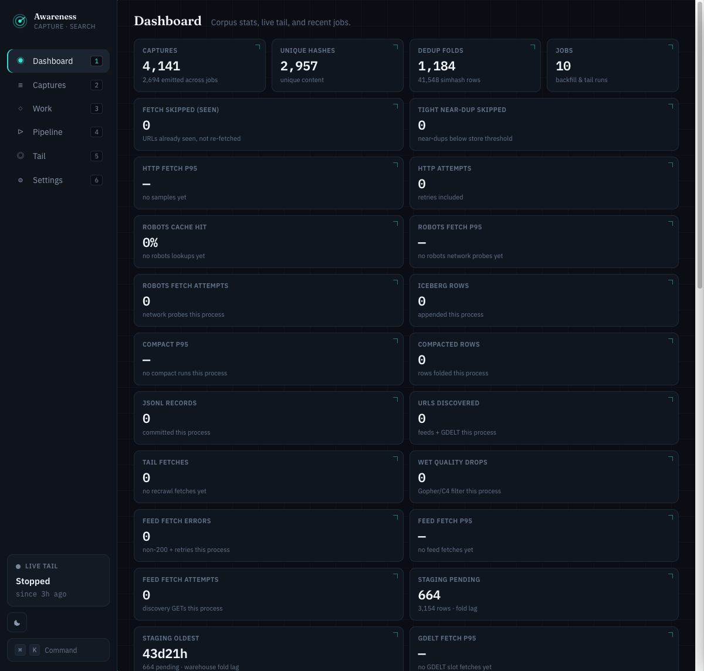

#### Captures
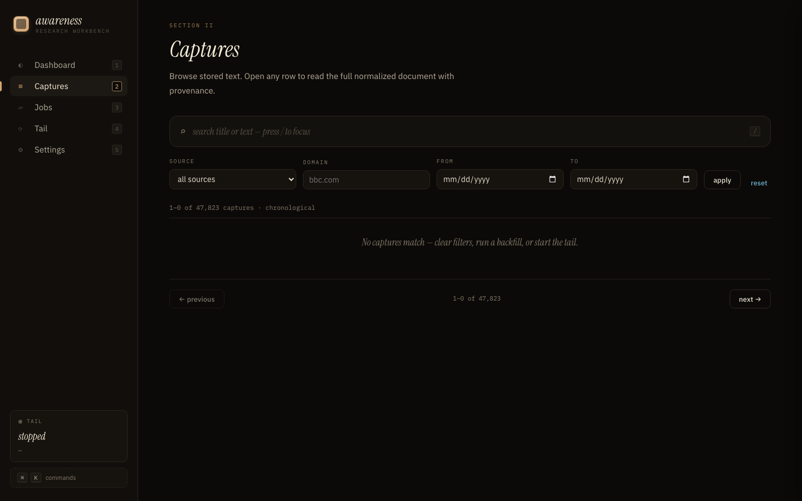

#### Jobs
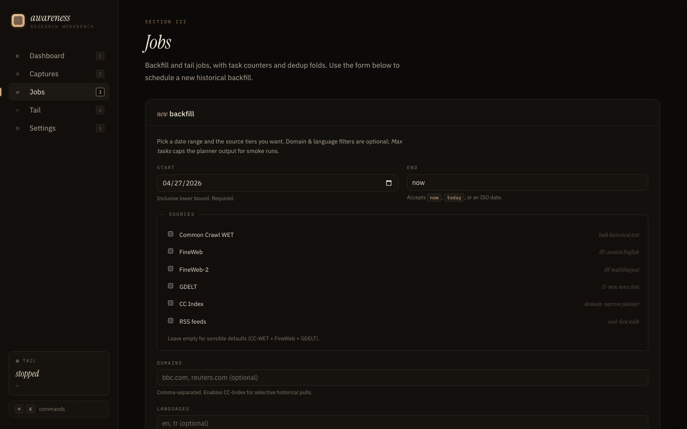

#### Tail (live capture)
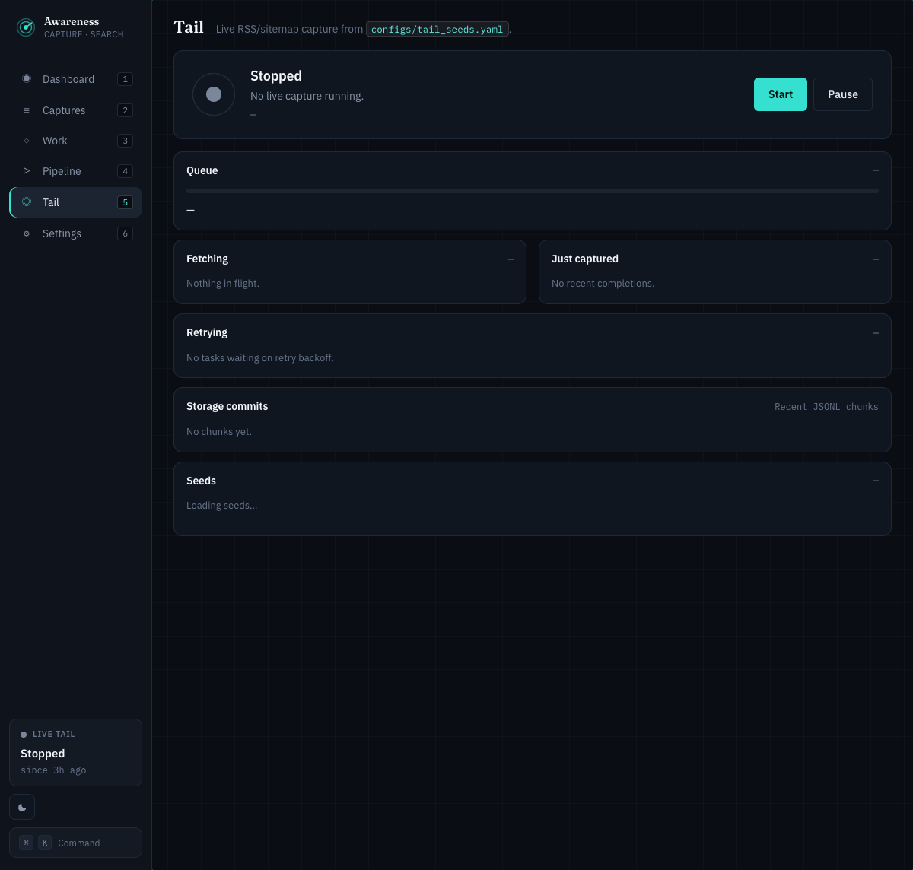

#### Settings
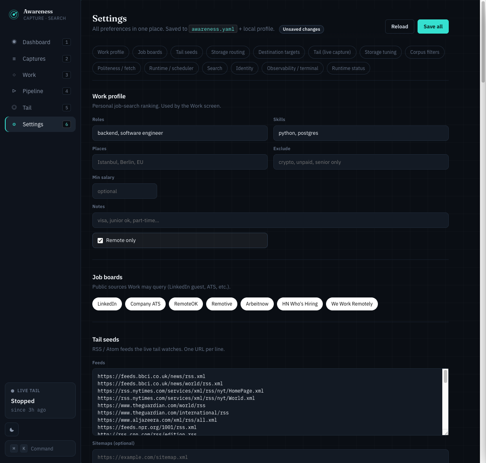

Single-process Python + FastAPI + a hand-written vanilla SPA in `src/awareness/api/web/`. Five sections (Dashboard / Captures / Jobs / Tail / Settings) with keyboard shortcuts (`1`–`5`) and a `⌘K` command palette.

---

## Benchmarks

Awareness is benchmarked **head-to-head against the de-facto peer in each
space**, on one machine, over a **deterministic** synthetic corpus (fixed seed —
the corpus and the accuracy numbers reproduce exactly; throughput drifts with
hardware/load). Where a result trailed the standard, the gap was closed with a
*real code change*, then re-measured. Nothing here is hand-tuned to flatter a
single number; figures below are from one representative run (`results.json`).

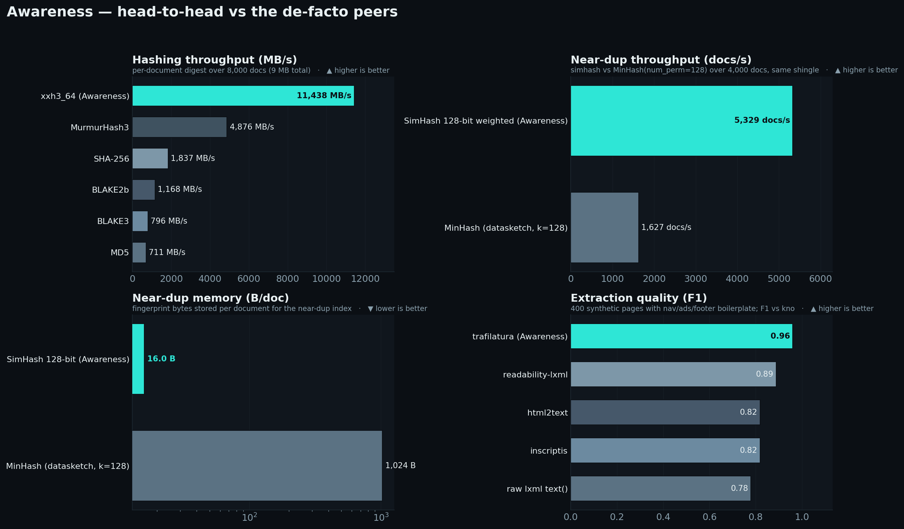

```bash
uv pip install -e '.[bench]'
python -m benchmarks.run_all      # writes docs/benchmarks/results.json
python -m benchmarks.plot         # renders the charts below
```

<sub>Machine for the numbers below: Apple Silicon (arm64), Python 3.11, single core. Peers: datasketch 1.10, BLAKE3 1.0, trafilatura, DuckDB FTS, SQLite FTS5.</sub>

### Near-duplicate detection — fixed the fingerprint *and* the retrieval

Awareness dedups with a **128-bit frequency-weighted Charikar SimHash** +
Hamming threshold, indexed with Manku/Jain pigeonhole banding. The de-facto
peer is `datasketch` **MinHashLSH** (num_perm=128). We compare the **full
pipelines end-to-end** (retrieval + threshold + grouping) — the same way
text-dedup and datasketch report — not an all-pairs oracle.

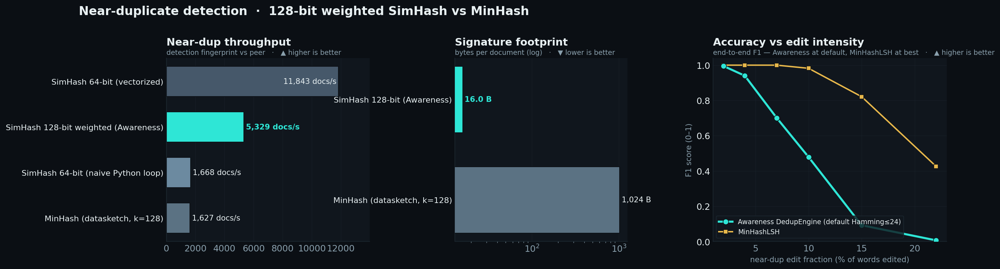

The original engine trailed badly: a 64-bit SimHash (separability F1 ~0.86) behind
an 8-band index that retrieved almost nothing at the realistic near-dup radius —
end-to-end recall was **~2%**. Three changes fixed it: a **128-bit
frequency-weighted fingerprint** (all-pairs *separability* **0.99**, on par with
MinHash — so the fingerprint was never the problem;
[text-dedup's CORE benchmark](https://github.com/ChenghaoMou/text-dedup) puts
plain 64-bit SimHash at 0.85, MinHash at 0.95), **finer 16×8-bit banding** (roughly
doubles candidate retrieval), and a **Hamming≤24 default** threshold.

| End-to-end (full pipeline) | **Awareness DedupEngine** | `datasketch` MinHashLSH |
| --- | --- | --- |
| **F1** (shipped default · tuned) | **0.84 · 0.96** | 0.998 |
| **Precision** | **1.00** — never false-merges | 0.999 |
| **Recall** (default · tuned) | 0.73 · 0.93 | 0.997 |
| **Throughput** | **≈5,200 docs/s** (3.3×) | ≈1,600 docs/s |
| **Signature size** | **16 B/doc** (64× smaller) | 1,024 B/doc |

Numbers are the **shipped default** (`near_threshold=24`); raised toward the
precision boundary (Hamming≤32) the engine reaches **F1 0.96 / recall 0.93 with
precision still 1.00** — the threshold is tunable per call. MinHashLSH is reported
at its F1-optimal Jaccard≥0.5 (≈ its default).

Honest verdict: **MinHashLSH wins recall** — its LSH needs no per-corpus tuning
and degrades more gracefully as edits grow (right-hand panel; at the shipped
default the curves separate above ~7% word edits). This is the well-established
SimHash↔MinHash trade. Awareness's SimHash is the **precision-first,
resource-frugal** choice: identical precision, **3.3× the throughput, 64× less
memory**, and — because dedup only ever sets a grouping hint and never drops a
row — lower recall costs a little less folding, never data.

### Content fingerprinting — xxh3 is the right call

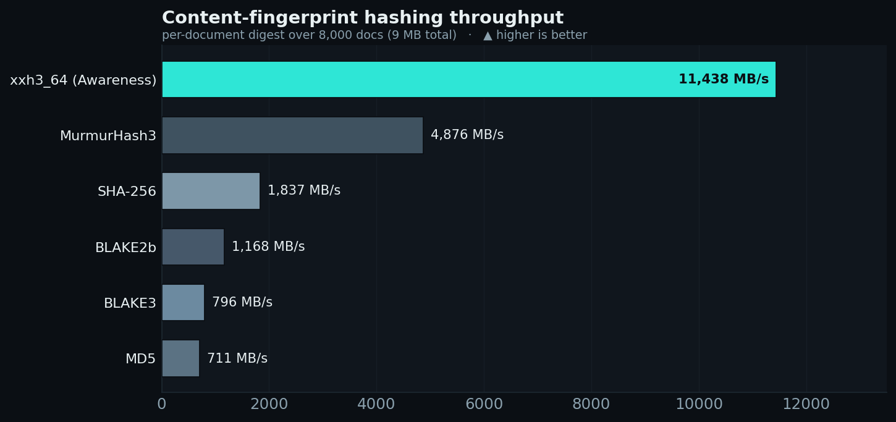

Awareness fingerprints every document for exact-dedup with `xxhash.xxh3_64`.
On per-document digests it is the fastest option measured — **≈11 GB/s**,
~2.4× MurmurHash3, ~6× SHA-256, and ~14–16× BLAKE3/MD5 — so exact-dedup is
never the bottleneck. (BLAKE3's SIMD edge shows on large contiguous buffers,
not the many small inputs Awareness actually hashes.)

### HTML → main-text extraction — riding the F1 leader

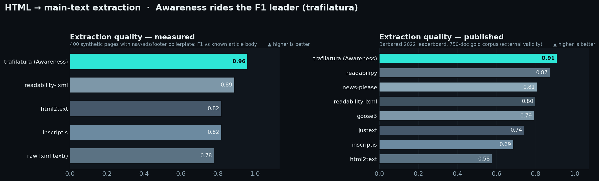

Awareness extracts article text with **trafilatura**, which tops both our
measured boilerplate-rejection test (**F1 0.96**) and the published
[Barbaresi 2022 leaderboard](https://trafilatura.readthedocs.io/en/latest/evaluation.html)
(**F1 0.909**, ahead of readabilipy, news-please, readability-lxml, goose3,
jusText, inscriptis, html2text). Honesty note: this quality costs speed —
trafilatura is the *slowest* extractor measured (~370 pages/s vs raw
tag-stripping at ~50k pages/s); Awareness deliberately spends that time to keep
boilerplate out of the durable corpus.

### Query & ingestion — optimizations shipped for this benchmark

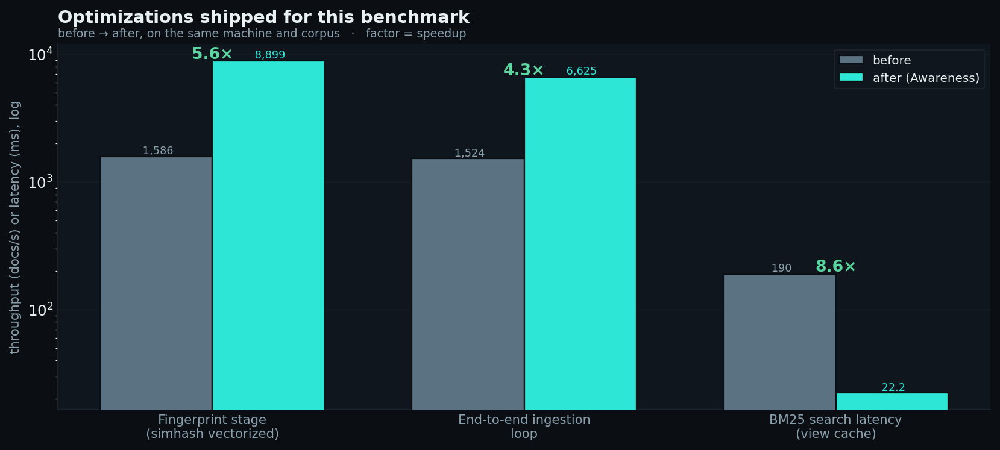

Three concrete improvements made while benchmarking (same machine, same corpus):

- **SimHash vectorization** — the per-shingle 64-bit accumulator loop was
  replaced with a NumPy bit-matrix; the fingerprint stage went **≈5–6× faster**
  (and is bit-identical for the 64-bit path).
- **End-to-end ingestion loop** (normalize → fingerprint → JSONL write) is
  **≈4× faster** as a result.
- **BM25 search latency** dropped **≈8–9×** (≈200 ms → ≈24 ms) after the DuckDB
  index stopped rebuilding its views on *every* query and instead refreshes
  only when the on-disk corpus changes.

Honesty note on search: a dedicated inverted index (SQLite FTS5) answers an
unranked lookup *much* faster (sub-millisecond vs ~24 ms here) — Awareness
chooses DuckDB so the *same* SQL engine serves BM25 search, range scans, and
Iceberg analytics over one lake, not because it's the fastest pure-FTS engine.

Full methodology and raw numbers live in [`benchmarks/`](benchmarks/) and
[`docs/benchmarks/results.json`](docs/benchmarks/results.json).

## Architecture

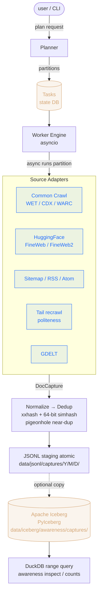

<details>
<summary>ASCII fallback diagram (for terminal viewers)</summary>

```
                 ┌──────────────────────────┐
   user/CLI ────►│        Planner          │── partitions ──┐
                 └──────────────────────────┘                │
                                                             ▼
                 ┌──────────────────────────┐      ┌────────────────────┐
                 │  Worker Engine (asyncio) │◄─────│  Tasks (state DB)  │
                 └─────────┬────────────────┘      └────────────────────┘
                           │ async runs partition
                           ▼
                 ┌──────────────────────────┐
                 │      Source Adapters     │  Common Crawl WET / CDX / WARC
                 │                          │  HF FineWeb / FineWeb2
                 │                          │  Sitemap / RSS / Atom
                 │                          │  Tail recrawl (politeness)
                 │                          │  GDELT
                 └─────────┬────────────────┘
                           │ DocCapture
                           ▼
                 ┌──────────────────────────┐
                 │  Normalize → Dedup       │  xxhash + 64-bit simhash
                 └─────────┬────────────────┘  pigeonhole near-dup index
                           │
                           ▼
                 ┌──────────────────────────┐
                 │  JSONL staging (atomic)  │  data/jsonl/captures/Y/M/D/*.jsonl
                 └─────────┬────────────────┘
                           │ optional copy
                           ▼
                 ┌──────────────────────────┐
                 │  Iceberg (PyIceberg)     │  data/iceberg/awareness/captures/
                 └─────────┬────────────────┘
                           │ query
                           ▼
                 ┌──────────────────────────┐
                 │   DuckDB ── range query  │  CLI: `awareness inspect / counts`
                 └──────────────────────────┘
```
</details>

### Layers

| Layer | Module | Purpose |
| --- | --- | --- |
| Config | `awareness.config.settings` | env + YAML overrides |
| Schemas | `awareness.schemas.{doc,jobs}` | canonical doc envelope + job state |
| Util | `awareness.util.*` | URLs, time, hashing, robots, ratelimit |
| Sources | `awareness.sources.*` | one adapter per data tier |
| Normalize | `awareness.normalize.{text,html}` | trafilatura wrapper + cleanup |
| Dedup | `awareness.dedup.engine` | exact + canonical-URL + simhash |
| Storage | `awareness.storage.{jsonl,iceberg,duckdb_index,state}` | staging + durable + query + state DB |
| Planner | `awareness.planner.planner` | request → partitions → tasks |
| Workers | `awareness.workers.engine` | async pool, backpressure, dedup, flush |
| Tail | `awareness.tail.engine` | live capture lifecycle |
| API/CLI | `awareness.{cli,api}` | user surface |

### Data model

The single durable schema is `DocCapture` (see [src/awareness/schemas/doc.py](src/awareness/schemas/doc.py)). Every adapter
produces it. Iceberg writes the same fields (see [iceberg_schema.py](src/awareness/storage/iceberg_schema.py)). All
timestamps are UTC. Provenance lives in `source_*` columns; identity in
`doc_id`/`capture_id`; dedup grouping in `parent_doc_or_dup_group`.

## Install

```bash
cd /path/to/awareness
uv venv --python 3.13 --seed
uv pip install -e '.[dev]'
# Optional: HuggingFace adapters
uv pip install -e '.[hf]'
# Optional: Postgres state DB
uv pip install -e '.[postgres]'
```

## Run

### Initialize storage

```bash
awareness init
```

### BODY — historical backfill

```bash
# Submit, then run in-process (CLI also has a separate worker entry).
awareness backfill submit --start 2024-06-01 --end 2024-06-14 --max-tasks 5
# → emits JOB_ID
awareness backfill run JOB_ID
awareness backfill status JOB_ID
```

### TAIL — live capture

```bash
# Edit configs/tail_seeds.yaml (RSS/Atom/sitemaps you want to watch).
awareness tail start            # foreground; Ctrl-C stops cleanly
# Alt: `awareness-tail` runs the same loop with signal-based shutdown.

awareness tail status
awareness tail stop             # cooperative stop request
```

### Inspect & metrics

```bash
awareness status
awareness inspect --start 2024-06-01 --end now --limit 25
awareness counts --start 2024-06-01 --end now
awareness dedup-stats
awareness metrics
```

### HTTP API

```bash
awareness-api                   # listens on 127.0.0.1:8085
# Endpoints: /healthz /status /metrics /backfill /tail /inspect /counts ...
```

## What this is and isn't

| Yes | No (despite earlier docs / commit messages) |
| --- | --- |
| Local-only ingestion: SQLite state, JSONL on disk, Iceberg on disk via PyIceberg | **There is no cloud storage**. Nothing leaves your machine. The `ops/compose` Postgres + MinIO + Redpanda + ClickHouse stack is opt-in scaffolding; it's not running by default and the code does not write to it. |
| Polling-based live updates: dashboard refreshes every 4–5s; tail view every 2s | **No Server-Sent Events / WebSocket push.** The "live activity feed" pulses when new captures land, but it polls; if the tail is idle (nothing new to discover) the UI shows the same numbers. |
| `tail_poll_seconds` cadence re-polls every configured RSS/Atom/Sitemap seed and re-arms the discovery task | Until commit `<bug-fix>` the reseed loop crashed silently on a UNIQUE constraint after the first iteration. If you were running an older build, your "tail" effectively ran *once* and then sat idle. |
| Robots.txt + per-domain politeness are enforced in `tail_recrawl` | We don't yet expose per-fetch robots outcomes in the UI. |
| `max_tasks` caps the *planner's* initial output | Sub-partitions enqueued by discovery adapters (CC index → WARC repair, GDELT slot → tail recrawl) are **not** capped by `max_tasks`. A single GDELT 15-minute slot can fan out into 1000+ sub-fetches. |

## Configuration

`configs/awareness.yaml` is the default config file; values set in YAML take
precedence over env vars (a quirk we'll fix). To set an env var, also remove
the corresponding line from `configs/awareness.yaml`.

Examples:

| Env | Meaning |
| --- | --- |
| `AW_PROJECT_ROOT` | base dir (default: this repo) |
| `AW_DATA_DIR` | where Iceberg + JSONL + state live |
| `AW_STATE_DB_URL` | SQLAlchemy URL (SQLite default; PG works) |
| `AW_USER_AGENT` | the bot identifier for HTTP fetches |
| `AW_PER_DOMAIN_CONCURRENCY` | live-fetch concurrency cap per domain |
| `AW_TAIL_POLL_SECONDS` | feed re-poll interval |
| `AW_ENABLE_ICEBERG` | toggle Iceberg writes (JSONL always on) |

## Storage layout

```
data/
├── jsonl/captures/YYYY/MM/DD/captures-*.jsonl  ← atomic staging (source of truth)
├── iceberg/                                    ← PyIceberg warehouse + catalog
├── state/awareness.sqlite                      ← jobs/tasks/manifests/dedup
├── checkpoints/                                ← reserved for adapters
├── dlq/                                        ← dead-letter task payloads
├── cache/                                      ← robots cache & helpers
├── warc/                                       ← cached WET/WARC bytes (TTLable)
└── logs/awareness.log
```

## Compliance

- Robots.txt: enforced via `RobotsCache` before any live fetch.
- Politeness: per-domain semaphore + min inter-request delay; crawl-delay
  honored if present in robots.txt.
- Public-only: adapters target publicly reachable corpora and surfaces.
- Text-only durable: HTML is converted to text and discarded; binary media
  is never persisted.

## Optional production stack (Docker)

`ops/compose/docker-compose.yml` runs Postgres + Redpanda + MinIO +
ClickHouse for those who want the analytics-grade environment. The same
Awareness binary points at it via env vars; no code change required.

```bash
docker compose -f ops/compose/docker-compose.yml up -d
```

See [docs/runbook.md](docs/runbook.md) for the operational handbook.

## Testing

```bash
pytest                  # all tests
pytest -m smoke         # smoke only
pytest -m integration   # integration only
```
